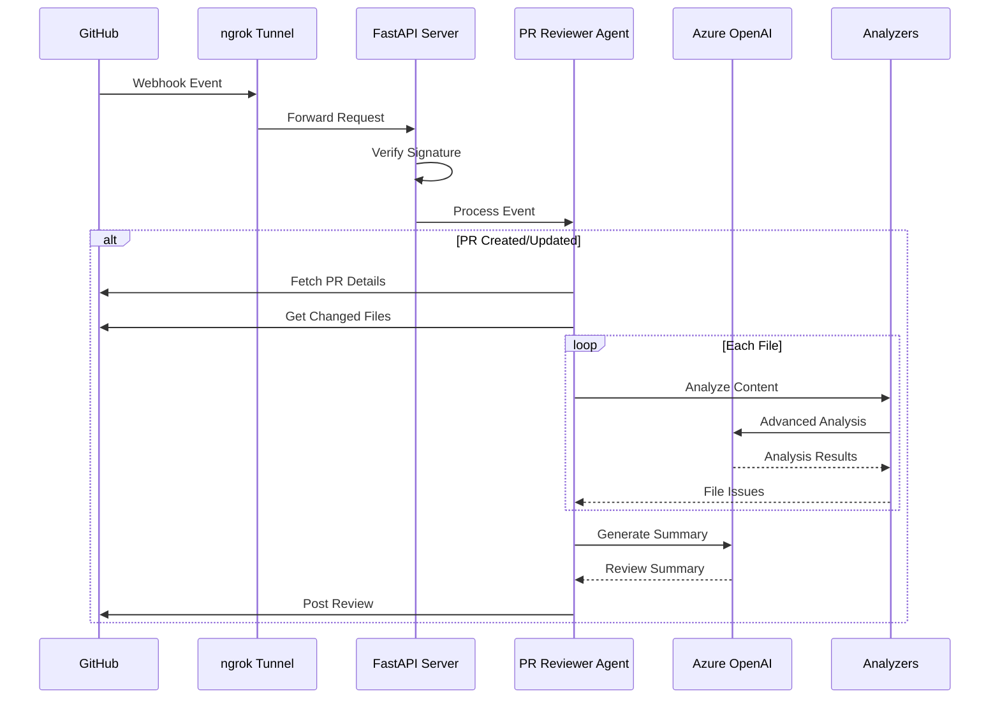

# Architecture Overview

## System Architecture

### High-Level Components

```
┌─────────────────┐     ┌──────────────────────┐     ┌─────────────────┐
│   GitHub API    │────▶│    FastAPI Server    │────▶│   Azure OpenAI  │
└─────────────────┘     │                      │     └─────────────────┘
        │               │  ┌──────────────┐    │            │
        │               │  │  PR Reviewer │    │            │
        │               │  │    Agent     │    │            │
        │               │  └──────────────┘    │            │
        │               │         │            │            │
        │               │         ▼            │            │
        │               │  ┌──────────────┐    │            │
        │               │  │  Analyzers   │◀───┴────────────┘
        │               │  └──────────────┘    │
        │               └──────────────────────┘
        │                         ▲
        │                         │
        │               ┌──────────────────┐
        └──────────────▶│  ngrok tunnel   │
                        └──────────────────┘
```

### Component Roles

1. **FastAPI Server**
   - Handles webhook events
   - Provides health endpoints
   - Manages async operations
   - Validates webhook signatures
   - Processes GitHub events

2. **PR Reviewer Agent**
   - Orchestrates review process
   - Manages analysis pipeline
   - Coordinates with GitHub API
   - Handles review feedback

3. **Analyzers**
   - Perform code analysis
   - Generate improvement suggestions
   - Detect security issues
   - Check code patterns

4. **ngrok Tunnel**
   - Provides public webhook endpoint
   - Enables local development
   - Handles SSL termination
   - Routes webhook requests

### Core Components

1. **FastAPI Application (`src/main.py`)**
   - Webhook endpoint handler
   - Request validation
   - Event routing
   - Health monitoring
   - Error handling
   ```python
   @app.post("/webhook")
   async def github_webhook(request: Request):
       """Handle GitHub webhook events with signature verification."""
   ```

2. **PR Reviewer Agent (`src/core/agent.py`)**
   - Event processing
   - Analysis coordination
   - Review management
   - Response generation
   ```python
   class PRReviewerAgent:
       """Core agent for managing PR reviews."""
       async def handle_github_event(self, event_type: str, event_data: dict)
       async def analyze_pull_request(self, repo: str, pr_number: int)
       async def post_review(self, repo: str, pr_number: int, results: dict)
   ```

3. **Analyzers (`src/analyzers/`)**
   - Security analysis
   - Code style checking
   - Architecture validation
   - Pattern detection
   ```python
   class SecurityAnalyzer:
       """Security vulnerability detection."""
       async def analyze(self, content: str, file_path: str)

   class CodeStyleAnalyzer:
       """Code style and best practices checking."""
       async def analyze(self, content: str, file_path: str)
   ```

4. **GitHub Integration (`src/utils/github.py`)**
   - API client
   - Webhook processing
   - Comment management
   - Rate limit handling
   ```python
   class GitHubClient:
       """GitHub API client with retry and rate limiting."""
       async def get_pull_request(self, repo: str, pr_number: int)
       async def create_review(self, repo: str, pr_number: int, review: dict)
       async def get_pr_files(self, repo: str, pr_number: int)
   ```

5. **Tunnel Management (`scripts/setup_tunnel.py`)**
   - ngrok tunnel setup
   - Webhook URL management
   - Connection monitoring
   - Auto-reconnection
   ```python
   class TunnelManager:
       """Manage ngrok tunnel for webhook delivery."""
       async def start_tunnel(self, port: int)
       async def monitor_connection(self)
       async def cleanup(self)
   ```

## Component Details

### FastAPI Application

The FastAPI application serves as the core server and follows these principles:

1. **Event-Driven Architecture**
   ```python
   @app.post("/webhook")
   async def github_webhook(request: Request):
       """Handle GitHub webhook events."""
       # Verify signature
       body = await request.body()
       signature = request.headers.get("X-Hub-Signature-256")
       verify_webhook_signature(signature, body, webhook_secret)
       
       # Process event
       event_type = request.headers.get("X-GitHub-Event")
       event_data = json.loads(body)
       await agent.handle_github_event(event_type, event_data)
   ```

2. **Health Monitoring**
   ```python
   @app.get("/health")
   async def health_check():
       """Health check endpoint."""
       return {
           "status": "healthy",
           "github": await check_github_connection(),
           "azure": await check_azure_connection()
       }
   ```

3. **Error Handling**
   ```python
   @app.exception_handler(HTTPException)
   async def http_exception_handler(request: Request, exc: HTTPException):
       """Handle HTTP exceptions."""
       return JSONResponse(
           status_code=exc.status_code,
           content={"detail": exc.detail}
       )
   ```

### PR Reviewer Agent

The agent orchestrates the review process and follows these principles:

1. **Asynchronous Processing**
   ```python
   class PRReviewerAgent:
       async def handle_github_event(self, event_type: str, event_data: dict):
           """Process GitHub events asynchronously."""
           task = asyncio.create_task(
               self.process_event(event_type, event_data)
           )
           self.active_tasks.add(task)
           task.add_done_callback(self.active_tasks.discard)
   ```

2. **Pipeline Architecture**
   ```python
   class ReviewPipeline:
       """Coordinate the review process."""
       async def process_pr(self, repo: str, pr_number: int):
           # 1. Fetch PR details
           pr_data = await self.github.get_pull_request(repo, pr_number)
           
           # 2. Run analyzers
           analysis_results = await self.run_analyzers(pr_data)
           
           # 3. Generate review
           review = await self.generate_review(analysis_results)
           
           # 4. Post feedback
           await self.github.create_review(repo, pr_number, review)
   ```

3. **Fault Tolerance**
   ```python
   class RetryHandler:
       """Handle retries with exponential backoff."""
       async def with_retry(self, func, *args, **kwargs):
           for attempt in range(self.max_retries):
               try:
                   return await func(*args, **kwargs)
               except Exception as e:
                   if attempt == self.max_retries - 1:
                       raise
                   await asyncio.sleep(self._get_delay(attempt))
   ```

### Analysis System

The analysis system consists of specialized analyzers and Azure OpenAI integration:

1. **Base Analyzer**
   ```python
   class BaseAnalyzer:
       """Base class for all analyzers."""
       
       async def analyze(self, content: str, file_path: str, pr_context: dict):
           """Run analysis on file content."""
           raise NotImplementedError
           
       async def get_summary(self, results: list):
           """Generate summary of findings."""
           raise NotImplementedError
           
       @property
       def supported_extensions(self):
           """File extensions this analyzer supports."""
           return []
   ```

2. **Security Analyzer**
   ```python
   class SecurityAnalyzer(BaseAnalyzer):
       """Security vulnerability detection."""
       
       async def analyze(self, content: str, file_path: str, pr_context: dict):
           """Detect security issues."""
           issues = []
           
           # Check for common vulnerabilities
           issues.extend(await self._check_sql_injection(content))
           issues.extend(await self._check_secret_exposure(content))
           issues.extend(await self._check_insecure_configs(content))
           
           # Use Azure OpenAI for advanced detection
           issues.extend(await self._analyze_with_llm(content))
           
           return issues
   ```

3. **Code Style Analyzer**
   ```python
   class CodeStyleAnalyzer(BaseAnalyzer):
       """Code style and best practices checking."""
       
       async def analyze(self, content: str, file_path: str, pr_context: dict):
           """Check code style and patterns."""
           issues = []
           
           # Basic style checks
           issues.extend(await self._check_formatting(content))
           issues.extend(await self._check_naming(content))
           issues.extend(await self._check_complexity(content))
           
           # Advanced pattern analysis with Azure OpenAI
           issues.extend(await self._analyze_patterns_with_llm(content))
           
           return issues
   ```

## Data Flow



### Key Processes

1. **Webhook Processing**
   ```
   GitHub Event
   └── Tunnel Forwarding
       └── Signature Verification
           └── Event Type Check
               └── Repository Validation
                   └── Event Processing
   ```

2. **Analysis Pipeline**
   ```
   PR Detection
   └── File Collection
       └── Content Analysis
           ├── Security Checks
           ├── Style Analysis
           └── LLM Enhancement
               └── Review Generation
   ```

3. **Response Flow**
   ```
   Results Aggregation
   └── Issue Prioritization
       └── Summary Generation
           └── Review Formatting
               └── Comment Posting
   ```

## Configuration Architecture

The configuration system uses a combination of environment variables and YAML files:

### 1. Environment Configuration (`example.env`)
```env
# GitHub Configuration
GITHUB_TOKEN=your_token_here
GITHUB_WEBHOOK_SECRET=your_webhook_secret
REPOSITORY_LIST=owner1/repo1,owner2/repo2

# Azure OpenAI Configuration
AZURE_OPENAI_API_KEY=your_api_key
AZURE_OPENAI_ENDPOINT=your_endpoint
AZURE_OPENAI_DEPLOYMENT=your_deployment

# Application Configuration
ENVIRONMENT=development
LOG_LEVEL=INFO
```

### 2. Application Settings (`config/settings.yaml`)
```yaml
# Server Configuration
server:
  host: "0.0.0.0"
  port: 8000
  workers: 4
  reload: ${ENVIRONMENT} == "development"

# GitHub Integration
github:
  api_version: "2022-11-28"
  webhook_events:
    - pull_request
    - pull_request_review
  max_comments_per_review: 50
  retry_config:
    max_attempts: 3
    initial_delay: 1
    max_delay: 60

# Analysis Configuration
analysis:
  security:
    enabled: true
    severity_levels:
      - critical
      - high
      - medium
      - low
    checks:
      - sql_injection
      - secret_exposure
      - insecure_config
  
  code_style:
    enabled: true
    rules:
      - naming_convention
      - code_complexity
      - documentation
      - best_practices

# Azure OpenAI Configuration
azure_openai:
  deployment: ${AZURE_OPENAI_DEPLOYMENT}
  temperature: 0.3
  max_tokens: 2000
  retry_config:
    max_attempts: 3
    initial_delay: 1

# Logging Configuration
logging:
  level: ${LOG_LEVEL}
  format: "%(asctime)s - %(name)s - %(levelname)s - %(message)s"
  handlers:
    file:
      enabled: true
      path: logs/agent.log
      max_size: 10MB
      backup_count: 5
    console:
      enabled: true
      format: colored
```

## Security Architecture

### 1. Request Security

1. **Webhook Verification**
   ```python
   def verify_webhook_signature(signature: str, body: bytes, secret: str):
       """Verify GitHub webhook signature."""
       if not signature:
           raise HTTPException(400, "No signature provided")
           
       expected = "sha256=" + hmac.new(
           secret.encode(),
           body,
           hashlib.sha256
       ).hexdigest()
       
       if not hmac.compare_digest(signature, expected):
           raise HTTPException(401, "Invalid signature")
   ```

2. **API Authentication**
   ```python
   class GitHubClient:
       """GitHub API client with authentication."""
       def __init__(self, token: str):
           self.session = aiohttp.ClientSession(headers={
               "Authorization": f"token {token}",
               "Accept": "application/vnd.github.v3+json"
           })
   ```

### 2. Data Security

1. **Secret Management**
   ```python
   class SecretManager:
       """Manage sensitive configuration."""
       def __init__(self):
           self.secrets = {}
           self._load_secrets()
           
       def _load_secrets(self):
           """Load secrets from environment/vault."""
           # Load from environment
           self.secrets["github_token"] = os.getenv("GITHUB_TOKEN")
           self.secrets["webhook_secret"] = os.getenv("GITHUB_WEBHOOK_SECRET")
           self.secrets["azure_key"] = os.getenv("AZURE_OPENAI_API_KEY")
   ```

2. **Data Handling**
   ```python
   class DataSanitizer:
       """Sanitize and protect sensitive data."""
       @staticmethod
       def clean_logs(message: str):
           """Remove sensitive data from logs."""
           patterns = [
               r"token [a-zA-Z0-9_-]+",
               r"key [a-zA-Z0-9_-]+",
               r"password [^\\s]+"
           ]
           for pattern in patterns:
               message = re.sub(pattern, "[REDACTED]", message)
           return message
   ```

## Performance Architecture

### 1. Async Processing

1. **Concurrent Analysis**
   ```python
   class AnalysisCoordinator:
       """Coordinate parallel analysis tasks."""
       async def analyze_files(self, files: List[dict]):
           tasks = [
               self.analyze_file(file)
               for file in files[:self.max_concurrent]
           ]
           return await asyncio.gather(*tasks)
   ```

2. **Rate Limiting**
   ```python
   class RateLimiter:
       """Manage API rate limits."""
       def __init__(self, max_requests: int, window: int):
           self.max_requests = max_requests
           self.window = window
           self.requests = []
           
       async def acquire(self):
           """Acquire a rate limit token."""
           now = time.time()
           self.requests = [t for t in self.requests if now - t < self.window]
           
           if len(self.requests) >= self.max_requests:
               sleep_time = self.window - (now - self.requests[0])
               await asyncio.sleep(sleep_time)
               
           self.requests.append(now)
   ```

### 2. Resource Management

1. **Memory Management**
   ```python
   class ResourceManager:
       """Manage application resources."""
       def __init__(self, max_memory_mb: int):
           self.max_memory = max_memory_mb * 1024 * 1024
           self.current_tasks = weakref.WeakSet()
           
       async def run_task(self, coro):
           """Run task with resource constraints."""
           if self._check_memory():
               task = asyncio.create_task(coro)
               self.current_tasks.add(task)
               return await task
           raise ResourceError("Memory limit exceeded")
   ```

2. **Task Scheduling**
   ```python
   class TaskScheduler:
       """Schedule and manage concurrent tasks."""
       def __init__(self, max_concurrent: int):
           self.semaphore = asyncio.Semaphore(max_concurrent)
           self.active_tasks = set()
           
       async def schedule(self, coro):
           """Schedule a task with concurrency control."""
           async with self.semaphore:
               task = asyncio.create_task(coro)
               self.active_tasks.add(task)
               try:
                   return await task
               finally:
                   self.active_tasks.remove(task)
   ```