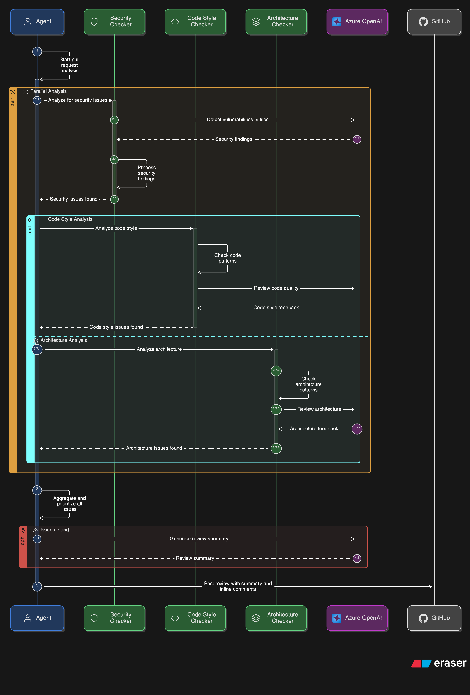
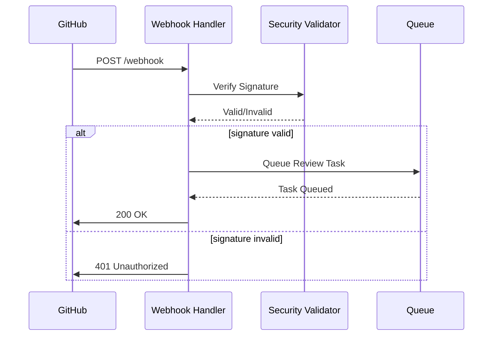
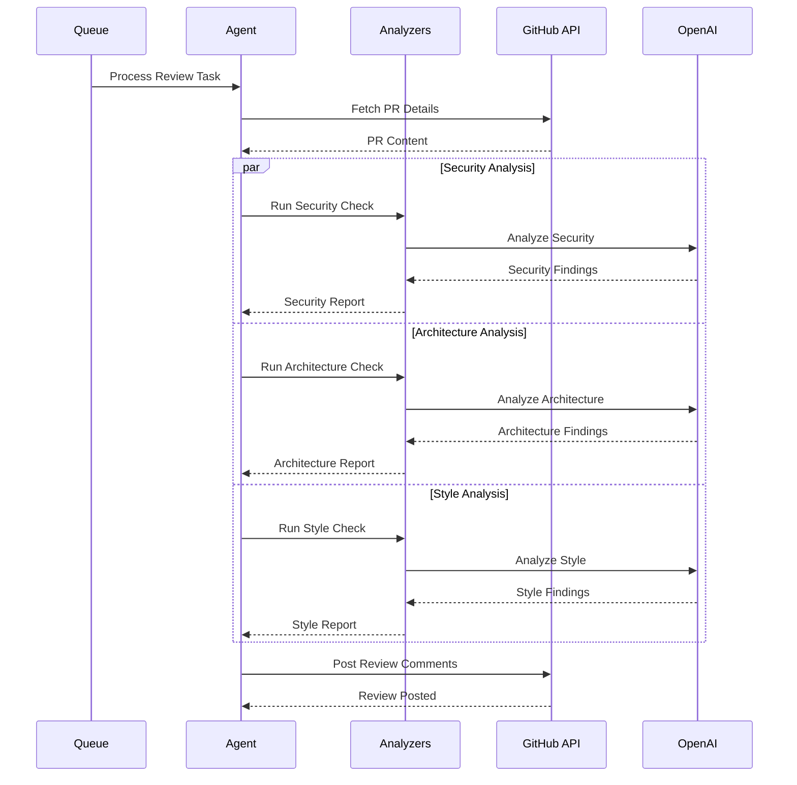
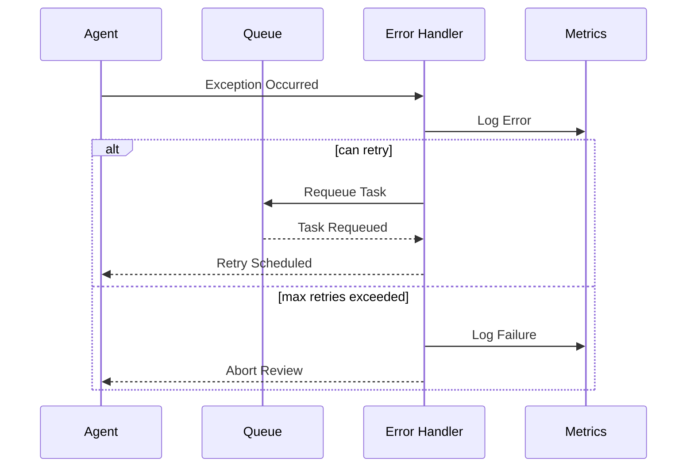

# Sequence Diagrams

This document provides sequence diagrams showing the key interactions between system components.

## Pull Request Review Flow

This diagram shows the complete flow of a pull request review from webhook trigger to review completion.

## Analysis Pipeline

The analysis pipeline flow shows how different analyzers process the code and aggregate results.

## Webhook Processing

Detailed flow of webhook processing including signature verification and rate limiting.

## Key Interactions

### 1. Webhook Reception

### 2. Code Analysis

### 3. Error Recovery

## Integration Points

The sequence diagrams above highlight several key integration points:

1. **GitHub Integration**
   - Webhook reception and validation
   - API interactions for PR data
   - Review comment posting
   
2. **Azure OpenAI Integration**
   - Code analysis requests
   - Natural language processing
   - Review summary generation
   
3. **Internal System Flow**
   - Task queueing and processing
   - Parallel analysis execution
   - Error handling and recovery

## References

- [Architecture Overview](architecture.md)
- [GitHub Integration Guide](github_integration.md)
- [Troubleshooting Guide](troubleshooting.md)